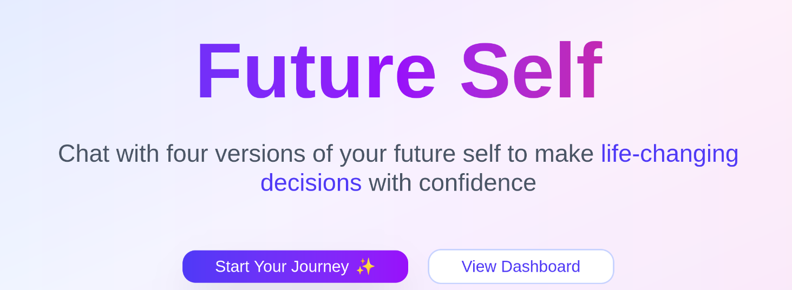
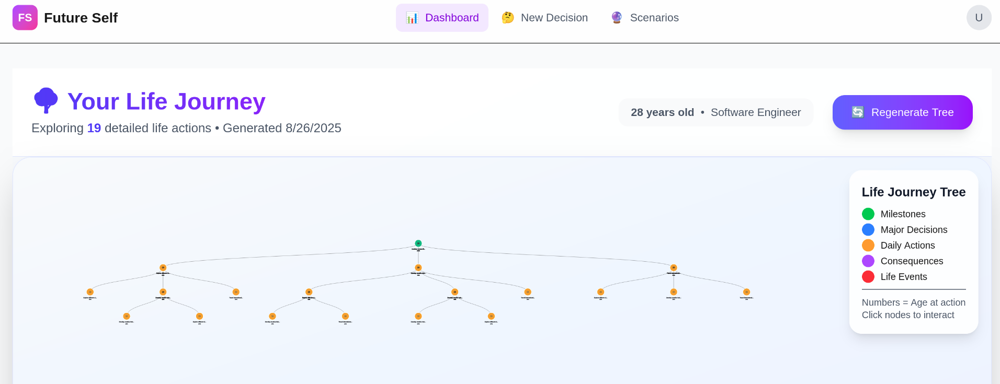

# 🌳 Future Self Decision Advisor




```bash
npm install && npm run dev
```

## ✨ Revolutionary Concept

Instead of asking an AI what to do, you **chat with future versions of yourself** who lived through the consequences:

- **🌟 The Visionary** - "Everything worked out perfectly!"
- **⚖️ The Balanced** - "Here's what actually happened..."  
- **🛡️ The Sage** - "I'm glad I played it safe"
- **🚀 The Explorer** - "I took the leap and it paid off!"

## 🔥 Key Features

**🧠 Psychology-Driven**: 3-tier assessment system with Big Five analysis  
**🌳 Interactive Tree**: Visual decision paths with `react-d3-tree`  
**💬 Future Conversations**: Chat with 4 AI personalities who "lived" your choices  
**📊 Life Impact**: Track Financial, Career, Health, Relationships, Happiness  

## ⚡ Tech Stack

Next.js 14 • TypeScript • Tailwind CSS • React D3 Tree • GPT-OSS Integration

## 🏆 Why This Matters

*50+ million people** struggle with major life decisions annually. This is the first app where you can **chat with alternate timeline versions of yourself** who lived through different outcomes. Revolutionary psychological approach to decision-making.

_Note: This project is a functional prototype, designed with maintainability in mind to allow for easy improvements and increased precision._